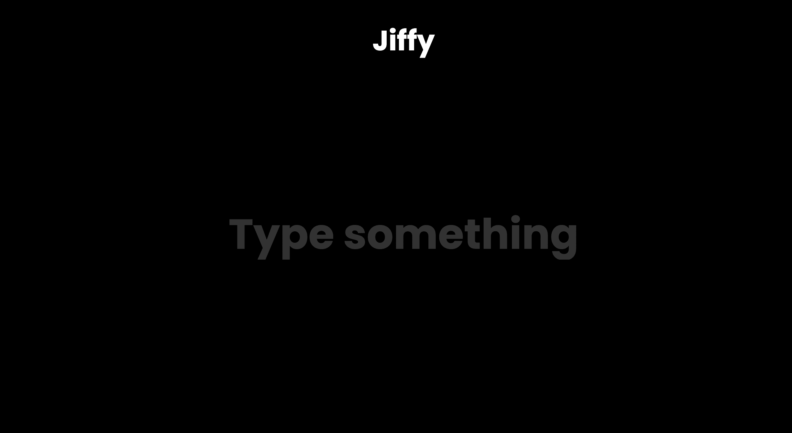

# Jiffy

Jiffy is a fun and interactive web app that generates GIFs based on user input. Simply type in any text, and Jiffy will fetch a related GIF for you. It's perfect for quickly finding the right GIF to express your thoughts or emotions.

## Features

- **Easy-to-use Interface**: Just type something and hit enter.
- **Instant GIF Search**: Fetches GIFs related to the user's input.
- **Smooth Transitions**: Enjoy seamless transitions between different GIFs.
- **Responsive Design**: Works well on both desktop and mobile devices.

## Demo

Check out the live demo: [Jiffy](https://jiffy-gif.vercel.app/)

## Screenshots


*The home screen where you can type your text.*


*A sample GIF fetched based on the user's input.*

## Installation

To get a local copy up and running, follow these simple steps.

1. **Clone the repository:**
   ```bash
   git clone https://github.com/Rishabh770777/jiffy.git
   
2. **Navigate to the project directory:**
    ```bash
    cd jiffy
    
3. **Open `index.html` in your browser:**
    You can open the index.html file directly in your web browser to start using Jiffy.

## Usage

To use Jiffy, simply open the `index.html` file in your web browser and follow these steps:

1. **Type a word or phrase** into the input field.
2. **Press Enter** to generate a GIF based on the input text.
3. **Enjoy the generated GIFs**. You can hit enter again to search for more memes related to your input.

## License

Distributed under the MIT License. See `LICENSE` for more information.